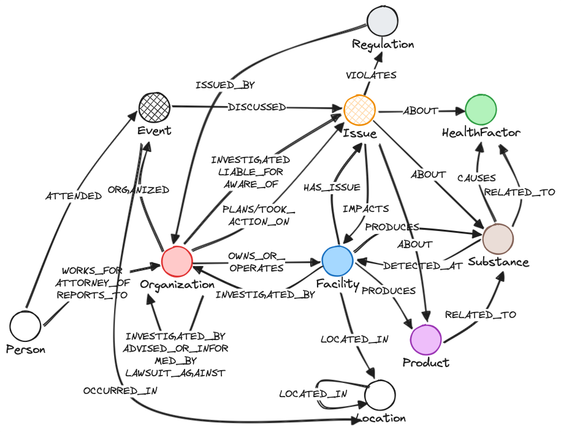

# Judicial Knoweldge Graph

Build a KG from textual legal documents in environmental contamination domain with this schema:


## How to run

### 1. Configure Neo4j & OpenAI API
Create Neo4j instance and adjust `.env` file content as needed. The Neo4jWriter class uses these env variables to create Neo4j connection, same for OpenAI API.
Example of `.env` file:
```commandline
OPENAI_API=sk-zf6...

NEO4J_URI=neo4j+s://<auradb_id>.databases.neo4j.io
NEO4J_USERNAME=neo4j
NEO4J_PASSWORD=...
```

### 2. Choose digitised data
You can put your dataset you want to ingest & process into `tests/data` dir with the whole directory structure. The code will later on model this directory structured in the KG and will store content of JSON files as node property.

For example: `tests/data/Sample Data Set for MC+A-20210708T192749Z-001/Sample Data Set for MC+A/NJDEP v. DuPont, et al. Filings/NJ Repauno/*.json`

### 3. (Optional) Adjust prompts or Cypher queries
* `tests/resources/prompts`: versioned prompts for extracting knowledge from texts (current latest is `v4`)
* `tests/resources/queries`: Cypher queries and templates for building KG 
* `tests/resources/schema.txt`: desired KG schema in the CSV format `source_class,relation,target_class`

Normally, you don't need to touch these unless you want to add entities/relations, they are fully functional & tested.

### 4. Use the KnowledgeGraph class to run extraction & create meta-graph
To build a KG from the chosen data set, go to `tests/test_kg.py` and run:
* `test_kg_ingestion`: sets-up Neo4j indices & crawls the data directory to extract all JSON files and store them to Neo4j (directory structure as well as file content)
* `test_kg_extraction`: after the previous step finishes, run the actual knowledge extraction using GPT based on specified version of the prompt (current latest is `generic_v4`)

This creates first version of the graph - a "meta-KG": it stores all entites GPT identified as `Entity` class nodes, and all relations as `RELATED_TO_ENTITY` relation types (both with relevant properties). This layer allows to see everything that GPT identified, even what we didn't ask it for. We can also run at this level various cleansings & resolutions before creating a final KG layer.

### 5. Create final KG layer
Use schema defined in the config directory (see step 3) to build the final clean KG from the meta-KG built in step 4.
